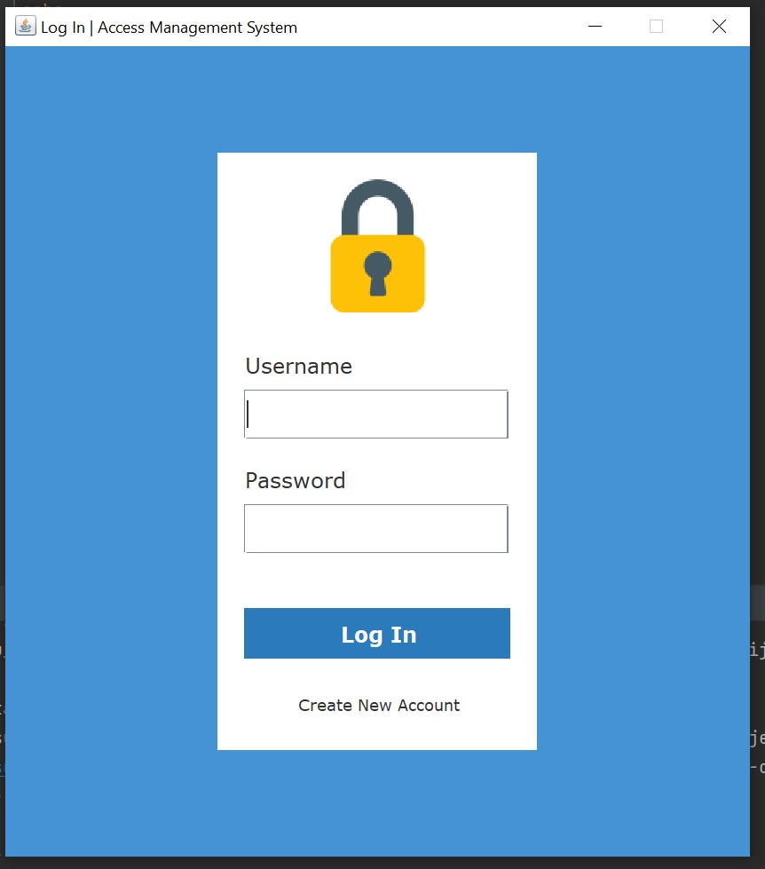
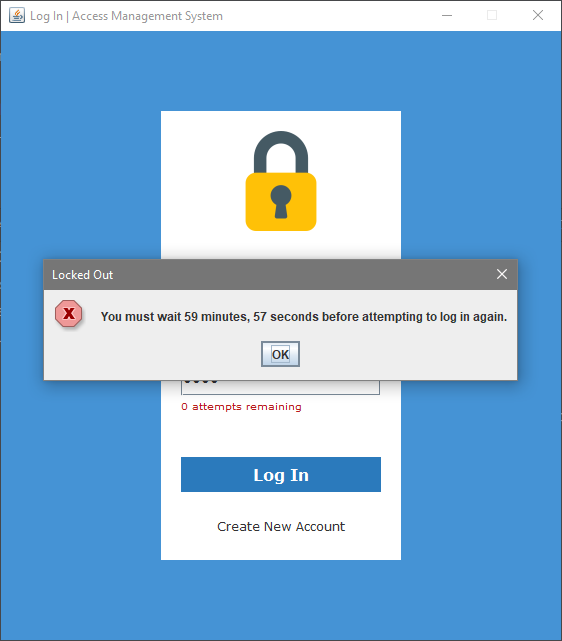
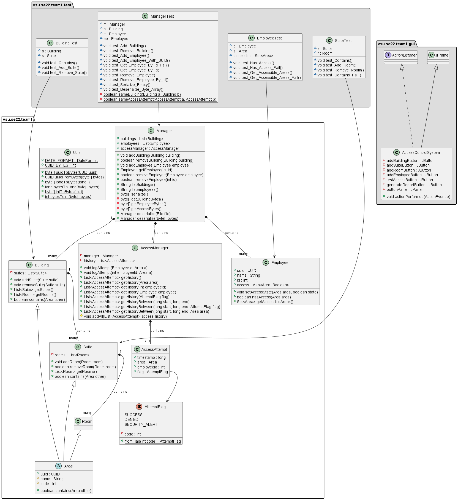
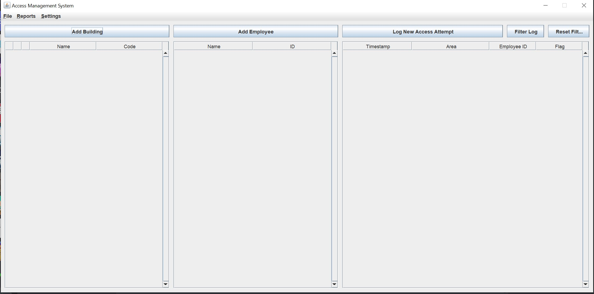
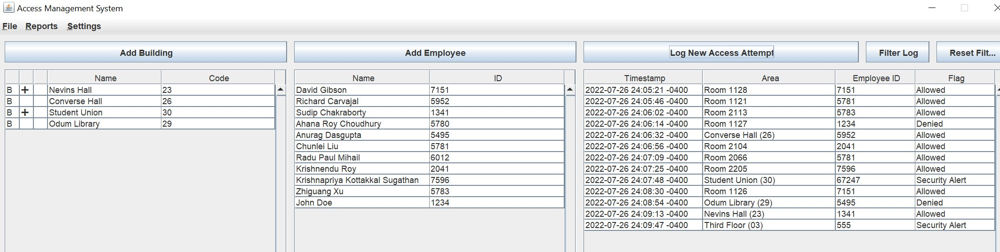
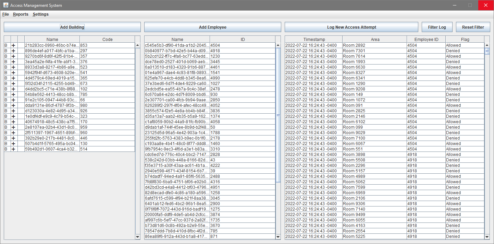

# This is the Access Control System Project that my team and I work on together.

### Team members: 
- [Jay Madison](https://github.com/JayMad18)
- [Nijel Roberts](https://github.com/nijelroberts)
- [David Tan](https://github.com/skytruong90)
- [Chase Vaughan](https://github.com/cvaugh)

## Here is a Live Demo:
https://youtu.be/E2mCG2c9Gq0

## Objective: To create a GUI based system that allows a user to manage buildings, suites, and rooms; employees; and employees access to buildings, suites, and rooms. The system also has a way to test an employee’s access to a room. Finally, the system can be used to generate various reports about access to rooms.

## This is the Login Screen:

## This is the class diagram that explain the layout of the project:

## This is the main interface of the GUI, where you can add buiding, room, suite and employees:

## This is when I was system testing the GUI:

## How to install:
1. Clone the repository: git clone https://github.com/skytruong90/Access_Control_Management_GUI.git
2. The main code is inside the GUI folder when you download everything.
3. `cd to GUI`
4. `cd 22su_team1`
5. Build the project with Maven: mvn clean install.
6. Run the project: java -jar target/access-control-system-1.0.0.jar

